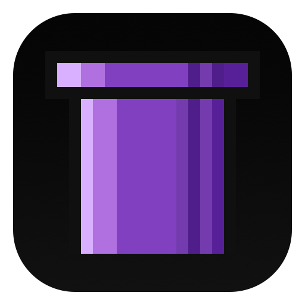

# Hyperpipe Desktop



Hyperpipe Desktop is the Electron renderer and shell for the Hyperpipe peer-to-peer relay client. It consumes the published `@squip/hyperpipe-core`, `@squip/hyperpipe-core-host`, and `@squip/hyperpipe-bridge` packages at build and runtime.

## What lives here

- The desktop renderer application
- The Electron main/preload shell under [`./electron`](./electron)
- Desktop packaging config and shell icon assets
- End-to-end and unit tests for the desktop client

## Development

```bash
npm install
npm run dev:web
```

In a second terminal, start the Electron shell:

```bash
npm run dev:electron
```

## Packaging

Regenerate the shell icons from the splash-pipe source when branding changes:

```bash
npm run build:icons
```

Build a local desktop package:

```bash
npm run dist:desktop -- --dir
```

## Feature Flags

Renderer feature visibility can be toggled with Vite env flags (values: `true/false`, `1/0`, `enabled/disabled`):

- `VITE_FEATURE_EXPLORE_ENABLED`
- `VITE_FEATURE_LISTS_ENABLED`
- `VITE_FEATURE_BOOKMARKS_ENABLED`

Default behavior in this codebase:

- Explore: disabled
- Lists: enabled
- Bookmarks: enabled

## Notes

- `package-lock.json` is intentionally ignored in this package.
- The icon pipeline writes tracked outputs only; temporary iconset files are created in the OS temp directory, not in the repo.

## License

MIT
